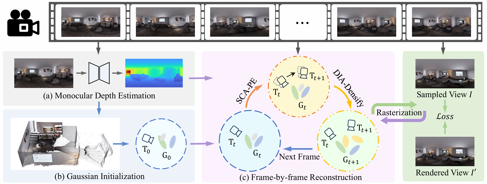

Implementation of **"Pose-Free Omnidirectional Gaussian Splatting for 360-Degree Videos with Consistent Depth Priors"** (CVPR 2026).

<div align="center">
  
</div>

## Installation

The code requires an environment with **PyTorch >= 2.0** and **CUDA >= 11.7**. You can set up the environment using the following commands:

```
conda create -n pfgs360 python=3.11
conda activate pfgs360
pip install torch==2.5.1 torchvision==0.20.1 torchaudio==2.5.1 --index-url https://download.pytorch.org/whl/cu124
pip install numpy==1.26.4 matplotlib==3.7.2 evo==1.13.1 ninja pillow pandas tensorboard scikit-image scikit-learn scipy tqdm pylint ipython jupyter shapely colorama wheel pybind11
pip install kornia einops torch-tb-profiler ipdb plyfile timm open3d opencv-python  nvitop pyproj openEXR

pip install git+https://github.com/nerfstudio-project/nerfstudio@v1.1.5
pip install git+https://github.com/rusty1s/pytorch_scatter@2.1.2
pip install git+https://github.com/NVlabs/tiny-cuda-nn/#subdirectory=bindings/torch
pip install git+https://github.com/princeton-vl/lietorch
pip install git+https://github.com/facebookresearch/pytorch3d@v0.7.7
pip install git+https://github.com/thomgrand/torch_kdtree
```

In addition, you also need to install the following packages:

**1. Gsplat360 rasterizer**, which provides panoramic image rendering for 3DGS and gradient computation for camera poses

```
git clone --recursive https://github.com/zcq15/gsplat360
cd gsplat360
pip install .
```

**2. Spherical Distortion Package**, which provides tangent-plane convolution for computing SSIM and GNCC metrics on spherical images.

```
git clone https://github.com/meder411/Spherical-Package
cd Spherical-Package
python setup.py install
```

**3. UniK3D**, which provides monocular depth estimation for panoramic images.

```
git clone https://github.com/lpiccinelli-eth/UniK3D
cd UniK3D
pip install .
```


**5. PFGS360** Finally, install this repository to train and evaluate the PFGS360 model within the Nerfstudio framework.
```
git clone --recursive https://github.com/zcq15/PFGS360
cd PFGS360
pip install .

```

## Usage

This project is built on top of the [Nerfstudio](https://github.com/nerfstudio-project/nerfstudio) framework, and its training and evaluation procedures follow those of Nerfstudio. Below are example commands for training and evaluation on the OB3D and Ricoh360 datasets.

**1. OB3D dataset**
```
ns-train pfgs360 --experiment-name OB3D-Egocentric ob3d-dataparser --data /path/to/OB3D/archiviz-flat --trajectory_type Egocentric
ns-eval --load-config outputs/OB3D-Egocentric/archiviz-flat/pfgs360/config.yml --output-path outputs/OB3D-Egocentric/archiviz-flat/pfgs360/results.json --render-output-path outputs/OB3D-Egocentric/archiviz-flat/pfgs360/results
```

**2. Ricoh360 dataset**
```
ns-train pfgs360 --experiment-name Ricoh360 odgs-dataparser --data /path/to/Ricoh360/bricks
ns-eval --load-config outputs/Ricoh360/bricks/pfgs360/config.yml --output-path outputs/Ricoh360/bricks/pfgs360/results.json --render-output-path outputs/Ricoh360/bricks/pfgs360/results
```


### Citation

If you find this project useful in your research or applications, please consider citing:
```bibtex
@misc{zhuang2026posefreeomnidirectionalgaussiansplatting,
      title={Pose-Free Omnidirectional Gaussian Splatting for 360-Degree Videos with Consistent Depth Priors}, 
      author={Chuanqing Zhuang and Xin Lu and Zehui Deng and Zhengda Lu and Yiqun Wang and Junqi Diao and Jun Xiao},
      year={2026},
      eprint={2603.23324},
      archivePrefix={arXiv},
      primaryClass={cs.CV},
      url={https://arxiv.org/abs/2603.23324}, 
}

@inproceedings{piccinelli2025unik3d,
  title={Unik3d: Universal camera monocular 3d estimation},
  author={Piccinelli, Luigi and Sakaridis, Christos and Segu, Mattia and Yang, Yung-Hsu and Li, Siyuan and Abbeloos, Wim and Van Gool, Luc},
  booktitle={Proceedings of the Computer Vision and Pattern Recognition Conference},
  pages={1028--1039},
  year={2025}
}

@article{eder2019mapped,
  title={Mapped convolutions},
  author={Eder, Marc and Price, True and Vu, Thanh and Bapat, Akash and Frahm, Jan-Michael},
  journal={arXiv preprint arXiv:1906.11096},
  year={2019}
}

```
